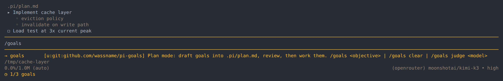

# pi-goals

Instead of a long plan, make a short list of goal in a one page markdown file. This way it's easy for you to review, and a subagent can just if each goal has been achieved.

The `goals.md` file looks something like this

```md
## <short plan title>

<context: one short paragraph. What the human wants and why.>

### User voice

- │ "<the human's requirement, quoted in full word for word (with spelling fixes)>"

### Goals

1. [ ] goal: <one short judgeable imperative outcome>
- subtle failure mode: <a way this could look done but isn't>
- discriminator: <the concrete observation that tells real success from that failure>
- tasks:
    1. [ ] <subtask>
- evidence: (empty until sign-off)

### Future work / out of scope
```



## Related work

Like [pi-milestones](https://github.com/Neuron-Mr-White/UniPi/tree/main/packages/milestone) and
[burneikis/pi-plan](https://github.com/burneikis/pi-plan), it guides rather than guards. The
reminder cadence is copied from [tintinweb/pi-tasks](https://github.com/tintinweb/pi-tasks) and the
resync-after-compaction from [tmonk/pi-goal-x](https://github.com/tmonk/pi-goal-x).

## Install

```bash
pi install npm:@wassname2/pi-goals
```

Or for development:

```bash
git clone https://github.com/wassname/pi-goals && cd pi-goals && npm install
pi -e ./src/index.ts
```

## Use

```
/goals CSV export for the report view
```

`/goals` enters plan mode and starts a conversation; the objective is an optional seed. From there:

1. Plan. The agent explores read-only
2. Review. The working set is printed in the transcript, then a menu asks Ready, Ready + compact,
   open in `$EDITOR`, or keep planning.
3. Work. The agent ticks subtasks, appends to `## Log` and `## Learnings`, fills `evidence:`, and
   calls `CompleteGoal` when a discriminator is satisfied. If it leaves the plan untouched for two
   turns, the working set is sent back with a short upkeep reminder.

Other commands: `/goals clear` deletes this session's plan file; `/goals judge <model-ref>` picks a
specific model for the sign-off judge (default: your current session model, else pi's default).

## Prompts

All model-facing text lives in [`src/prompts.ts`](src/prompts.ts), in flow order.

## Develop

```bash
pi -e ./src/index.ts        # load locally
npm test                    # vitest: judge argv invariants, appendLog, decideSignOff fail-forward
npm run typecheck
npm run lint
```

## License

MIT
